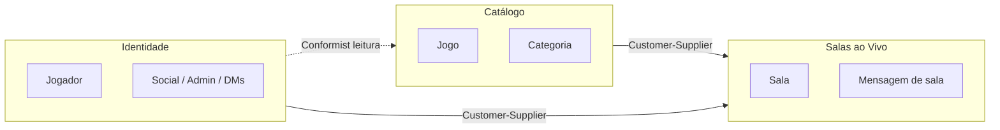

# Context Map — GameParty

**Entrada:** `docs/discovery.md`, `docs/glossary.md`  
**Versão:** 1.1 — revisado pós-MVP estendido

---

## Contextos

### Identidade (`identity`)

- **Responsabilidade:** registro, autenticação, perfil do **Jogador**, favoritos, social (amigos, DMs, bloqueios, denúncias, notificações), administração e logs de atividade.
- **Agregados principais:** `Jogador`
- **Value Objects:** `Email`, `DisplayName`, `FullName`, `Username`, `SenhaHash`, `PlayerRole`, ranks, etc.
- **Infra relevante:** `PrivateMessageHub` (WebSocket de DMs), `ConsoleEmailSender`, avatar storage local.
- **Não faz:** salas de jogo, catálogo (apenas referencia `GameId` como favorito).

### Catálogo de Jogos (`catalog`)

- **Responsabilidade:** cadastro e navegação de **Jogos**, **Categorias** e **Modos de Jogo**; busca; capas.
- **Agregados principais:** `Jogo`, `Categoria`
- **Value Objects:** `GameId`, `CategoryId`, `Slug`, `GameMode`
- **Não faz:** salas, mensagens, autenticação.

### Salas ao Vivo (`live-rooms`)

- **Responsabilidade:** **Salas** (incl. lobbies fixos por jogo), **Participantes**, **Mensagens** de sala; chat em tempo real via `ChatRoomHub`.
- **Agregados principais:** `Sala`, `Mensagem`
- **Value Objects:** `RoomId`, `RoomTitle`, `Capacity`, `RoomStatus`
- **Não faz:** CRUD de jogos, login; mensagens privadas (Identidade).

---

## Diagrama de contextos

---

## Relacionamentos

| Upstream | Downstream | Tipo | Integração |
|----------|------------|------|------------|
| **Catálogo** | **Salas ao Vivo** | Customer-Supplier | `GameId` + snapshot; lobbies fixos por jogo |
| **Identidade** | **Salas ao Vivo** | Customer-Supplier | `PlayerId` + display name ao entrar/enviar mensagem |
| **Identidade** | **Catálogo** | Conformist | Favoritos; leitura de catálogo |
| **Salas ao Vivo** | **Identidade** | ACL (leitura) | `PlayerProfileReader` para autor de mensagem |

Social (DMs, amigos) permanece **dentro de Identidade** — não virou bounded context separado.

---

## Contratos de integração

### Portas entre contextos

| Porta | Contexto dono | Consumidor |
|-------|---------------|------------|
| `GameCatalogReader` | Catálogo | Salas ao Vivo, Identidade (favoritos) |
| `PlayerProfileReader` | Identidade | Salas ao Vivo |
| `JogadorRepository` | Identidade | Admin, Social |

### Tempo real

| Hub | Escopo | Rota WS |
|-----|--------|---------|
| `ChatRoomHub` | Mensagens de sala | `/ws/salas/:roomId` |
| `PrivateMessageHub` | DMs | `/ws/social/mensagens?token=` |

**Proibido:** JOIN Prisma cross-module no domínio.

---

## Decisões de fronteira

| Decisão | Motivo |
|---------|--------|
| Favoritos no agregado **Jogador** | Perfil; não polui Catálogo |
| Lobbies fixos por jogo (seed) | UX simplificada; uma sala principal por título |
| Social no módulo **Identidade** | MVP estendido sem novo contexto |
| Lobby = apresentação | Compõe Catálogo + Salas; não é bounded context |
| Admin no módulo **Identidade** | Mesmo agregado `Jogador`, papéis e logs |

---

## Módulos (`src/modules/`)

| Pasta | Contexto |
|-------|----------|
| `src/modules/identity/` | Identidade (+ social + admin) |
| `src/modules/catalog/` | Catálogo de Jogos |
| `src/modules/live-rooms/` | Salas ao Vivo |
