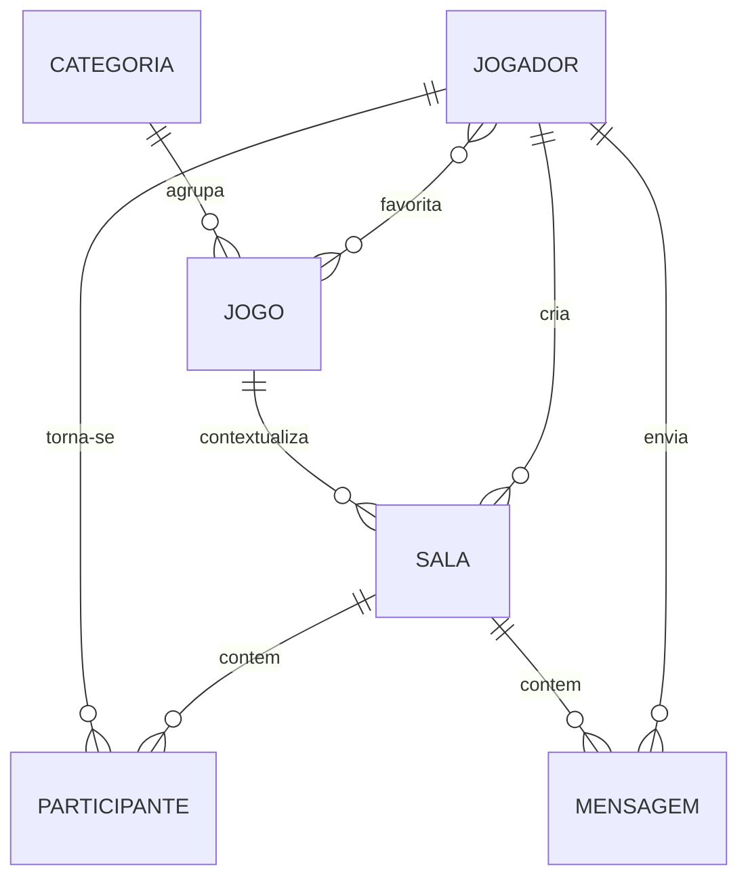

# Glossário — GameParty

Linguagem ubíqua inicial do domínio. Termos em **negrito** são bounded-context candidates para a Spec 02.

---

| Termo | Definição | Contexto |
|-------|-----------|----------|
| **Jogador** | Pessoa autenticada na plataforma com perfil (display name, favoritos). Pode criar salas, enviar mensagens e entrar em parties. | Identidade |
| **Visitante** | Usuário não autenticado que pode navegar lobby e categorias; permissões limitadas (sem criar sala). | Identidade |
| **Jogo** | Título cadastrado no catálogo (ex.: “Counter-Strike 2”, “Dungeons & Dragons 5e”) com slug único, categorias associadas e modos suportados. | Catálogo |
| **Categoria** | Agrupamento temático de jogos (FPS, RPG, MOBA, Survival, Cooperativo, etc.) usado para navegação e filtros. | Catálogo |
| **Modo de Jogo** | Forma de play buscada: **Online** (partidas/sessões avulsas) ou **Campanha** (grupos longos, compromisso recorrente). | Catálogo / Salas |
| **Sala** | Espaço de chat ao vivo vinculado a um jogo, com título, capacidade máxima, criador e status (aberta, cheia, encerrada). | Salas & Chat |
| **Party** | Grupo formado quando jogadores combinam jogar juntos; no MVP é um conceito social (marcação manual), não entidade persistida obrigatória. | Social |
| **LFG** | “Looking for Group” — intenção de buscar companhia; manifesta-se na criação ou entrada em salas. | Salas & Chat |
| **Lobby** | Área de listagem onde salas ativas e jogos em destaque são exibidos antes de entrar em uma sala específica. | Apresentação |
| **Mensagem** | Unidade de comunicação em tempo real dentro de uma sala, com autor, conteúdo textual e timestamp. | Salas & Chat |
| **Mensagem Privada** | Comunicação 1:1 entre dois jogadores, fora da sala pública. | Identidade / Social |
| **Participante** | Jogador que entrou em uma sala e pode enviar/receber mensagens até sair ou a sala encerrar. | Salas & Chat |
| **Capacidade** | Número máximo de participantes simultâneos permitidos em uma sala. | Salas & Chat |
| **Criador da Sala** | Jogador que abriu a sala; pode encerrá-la no MVP. | Salas & Chat |
| **Plataforma** | Hardware alvo da sessão (PC, PlayStation, Xbox, Switch, Mobile) — atributo de filtro futuro. | Catálogo |
| **Presença** | Estado de disponibilidade do jogador (online/offline no chat). | Social |
| **Amigo** | Relacionamento bidirecional entre jogadores após solicitação aceita. | Social |
| **Denúncia** | Reporte de comportamento inadequado, analisado no painel admin. | Social / Admin |
| **Insígnia / Nível** | Rank visual do jogador (por tempo na plataforma ou atribuição manual). | Identidade |
| **Administrador** | Papel `ADMIN` com acesso ao painel; insígnia 🎖️. O @admin principal usa insígnia Satoru Gojo. | Identidade |
| **Slug** | Identificador URL-friendly único para jogo ou categoria (ex.: `valorant`, `fps`). | Catálogo |
| **Favorito** | Jogo marcado no perfil do jogador para acesso rápido no lobby. | Identidade / Social |

---

## Relações entre termos

---

## Termos proibidos / alias

| Evitar | Preferir | Motivo |
|--------|----------|--------|
| Room (código) | **Sala** | Ubíqua PT-BR; `Room` só em camada técnica se inevitável |
| User | **Jogador** | Domínio específico de gaming |
| Channel | **Sala** | Discord-ism; produto não é clone de Discord |
| GameRoom | **Sala** | Redundante; jogo já é atributo da sala |

---

## Eventos de domínio (rascunho para Spec 03)

| Evento | Descrição |
|--------|-----------|
| `SalaCriada` | Nova sala aberta para um jogo |
| `JogadorEntrouNaSala` | Participante adicionado respeitando capacidade |
| `JogadorSaiuDaSala` | Participante removeu-se |
| `MensagemEnviada` | Nova mensagem na sala |
| `SalaEncerrada` | Criador ou sistema fechou a sala |

---

*Versão 1.1 — revisado pós-MVP estendido. Ver também [`context-map.md`](context-map.md).*
