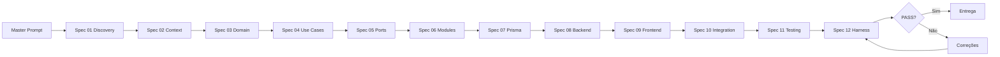

# Workflow — Pipeline de Desenvolvimento

## Visão geral

## Camadas de governança

| Camada | Função | Local |
|--------|--------|-------|
| Rules | Guia contínuo durante coding | `.cursor/rules/` |
| Specs | Etapas sequenciais com artefatos | `specs/` |
| Prompt | Orquestração do pipeline | `prompts/master-prompt.md` |
| Harness | Validação objetiva | `harness/scripts/` |

## Reprodutibilidade

- Mesmo prompt + mesmas specs → resultados estruturalmente equivalentes
- Validado em Cursor, Codex e assistentes compatíveis com Rules/AGENTS.md
- Harness elimina subjetividade na conformidade arquitetural

## Iteração

Após entrega MVP:
1. Nova feature → reiniciar do spec relevante (ex: 03 se muda domínio)
2. Sempre reexecutar harness antes de merge
